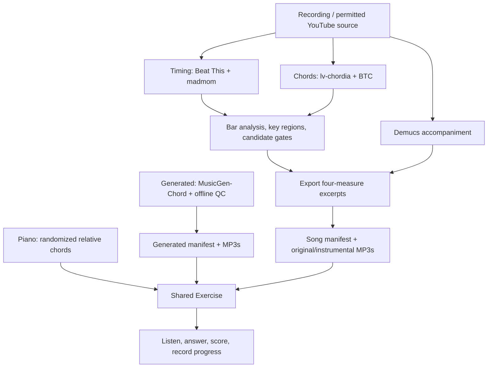

# Training a chord model for Chord Ear Trainer

Research and repository review: **September 20, 2026**. Code reviewed at
`21c99f0`. This is an implementation plan with copyable Python notebook code,
not a trained model or a measured accuracy improvement.

## 1. Recommendation

**Fine-tune the existing BTC model on a small, carefully corrected collection
of the kinds of songs this app uses. Run the first experiment on free Google
Colab. Measure the existing pipeline before changing it.**

Fine-tuning means starting with a model that already recognizes harmony and
adjusting its learned weights using examples with correct answers. Training
from scratch would discard that knowledge and require substantially more data.
We do not need to train a music generator, a vocal separator, or a large language
model. We need an audio classifier that identifies chords over time.

The first deliverable should be a trustworthy evaluation set. The second should
be a small training experiment. A production replacement comes only if that
experiment improves the accuracy of complete exercises on unseen songs.

There is a credible **$0 additional compute** path. There is no credible promise
that free compute plus a downloaded dataset will automatically beat the current
models. Correctly labeling representative music is the main investment.

### Read this guide in this order

1. Sections 2–4 explain what the app does and what accuracy means.
2. Sections 5–8 define the data, environment, and experiment.
3. Section 9 contains the Python notebook cells for a first fine-tuning run.
4. Sections 10–12 describe evaluation, integration, and realistic expectations.

## 2. Current architecture

### The application is a static client plus offline content tooling

There is no application API server, hosted inference service, training service,
or central user database in this repository. React/TypeScript renders practice;
Zustand holds state; localStorage preserves settings and exercise progress.
Python scripts create the Real Music assets before users load the app.



### Browser modules

- [`src/main.tsx`](src/main.tsx) and [`src/App.tsx`](src/App.tsx) mount the app.
  [`src/pages/Practice.tsx`](src/pages/Practice.tsx) coordinates library loading,
  source selection, playback, replay, skip, and the practice interface.
- [`src/theory/`](src/theory/) defines chords, Roman numerals, pools, and piano
  voicings. The answer vocabulary is **12 relative roots × major/minor/diminished**.
  A `Chord.rootPc` is relative to the tonic, not an absolute pitch class.
- [`src/engine/round.ts`](src/engine/round.ts) generates piano rounds and scores
  answers. [`src/store/session.ts`](src/store/session.ts) manages the round's
  lifecycle. The first chord is supplied and excluded from the user's score.
- [`src/audio/synthSource.ts`](src/audio/synthSource.ts) uses Tone.js and local
  piano samples; [`src/audio/clipPlayer.ts`](src/audio/clipPlayer.ts) uses an
  HTMLAudioElement. Generated clips play two progression passes. Real Music
  plays one excerpt with explicit chord cue timestamps.
- [`src/clips/`](src/clips/) and [`src/store/clips.ts`](src/store/clips.ts) adapt
  generated assets into the shared `Exercise` type.
- [`src/songs/`](src/songs/) handles recorded exercise conversion, difficulty,
  artist selection, and progress filtering. [`src/store/songs.ts`](src/store/songs.ts)
  loads the manifest and manages downloads. [`src/store/progress.ts`](src/store/progress.ts)
  records attempts by excerpt ID; these are **learner results**, not verified
  labels for training.
- [`src/components/`](src/components/) contains the answer pad, measure-grouped
  slots, controls, settings, offline library, install action, and keyboard.
  [`src/pages/PracticeQueue.tsx`](src/pages/PracticeQueue.tsx) shows learning progress.
  [`src/reportIssue.ts`](src/reportIssue.ts) builds a prefilled GitHub issue URL
  for answer-key reports. It does not collect an automatically verified dataset.

### Three sources, plus an instrumental playback variant

Piano creates known chords directly. Generated mode asks MusicGen-Chord on
Replicate to follow a known progression, then checks the result with
[`scripts/qcClips.py`](scripts/qcClips.py). Generation prompts are not proof of
what was played. The QC script compares the detector against the requested
root/quality at bar level.

Real Music derives its answer key from recordings. The instrumental toggle
chooses a Demucs-produced accompaniment file with the **same answer key and
cues**. It is not a fourth recognition model. Recognition uses the mixed
recording by default; `--chord-audio instrumental` is an existing experimental
alternative and should remain opt-in until independently evaluated.

At review time the manifests contain **59 generated clips** and **67 Real Music
excerpts from 21 artist/title pairs**, with **67 instrumental counterparts**.
There are 11 distinct artist strings, including inconsistent spellings of the
same artist. Normalize artist/work identities before splitting training data.

### Real Music build pipeline

1. Node wrappers in [`scripts/recordings/`](scripts/recordings/) select the
   `.venv-recordings` Python environment. `download_youtube.py` downloads one
   permitted recording and provenance. `process_song.py` orchestrates analysis
   and publication; its chord pair is currently hard-coded as `lv-chordia,btc`.
2. `analyze_song.py` normalizes audio, runs Beat This and madmom, and resolves
   their outputs to a fixed 4/4 measure grid. Compatible grids can be averaged;
   incompatible timing results do not by themselves constitute a universal
   two-model rejection gate.
3. `chord_models.py` converts both detectors to
   `[{start_time, end_time, chord}]`. lv-chordia uses `ismir2017` decoding.
   BTC uses the Hugging Face package `puar-playground/btc-chord` at revision
   `d436f2f664f5107cd987774279b8ce171846e376`, with its large vocabulary by default.
4. Analysis simplifies labels, calculates bar sequences and agreement, estimates
   key/mode and sustained tonality regions, and builds non-overlapping,
   phrase-aligned four-measure candidates. Metadata sidecars can correct phrase
   starts, tonalities, publication boundaries, individual chord slots, and
   excluded windows.
5. `export_candidates.py` checks eligibility, requires two chord predictions
   and complete simplified sequence agreement, rejects single-chord windows,
   and deduplicates relative sequences within each song. Demucs makes a cached
   full-song accompaniment; FFmpeg exports aligned original/instrumental MP3s.
6. Publication writes `public/song-clips/manifest.json`, including audio hashes
   in the library version and byte totals, then writes a local audit report.
   The report is generated **after automatic publication**.

The manifest is the stable boundary between machine learning and the app.
Improving a detector should not require moving inference into the browser.

### Online, installed, and offline behavior

[`vite.config.ts`](vite.config.ts) precaches the shell and local piano MP3s.
Online Real Music uses network assets without installation or a Download tap.
Offline selection requires cached song entries; Real Music has an explicit empty
state instead of substituting piano. Only Generated mode has the loading-time
piano fallback. Song URLs retain `?library=<version>` and shared cache names.
The current 500-file audio cache limit comfortably exceeds the 134 song MP3s.

Tests cover TypeScript theory, scoring, stores, selection, audio helpers, and
Python recording logic. They test software behavior, not acoustic correctness
against a human-annotated benchmark. `npm test` runs Vitest; Python unittests are
separate. A production build generates the service worker.

## 3. What currently limits reliability

### Agreement is not accuracy

`_agreement()` calculates the most common prediction's vote fraction. With two
models, agreement is normally 50% or 100%. Both can be confidently wrong.
`Candidate.score` is average explained chord occupancy, not a probability that
the answer key is correct. Neither model adapter preserves calibrated
probabilities. The rough accuracy percentage previously mentioned in
`ARCHITECTURE.md` is not a measurement on this library.

We therefore cannot say that the present app is 80%, 90%, or 100% accurate.
Published benchmark scores use specific corpora and vocabularies; they are not
interchangeable with this application's complete-exercise correctness.

### Non-model transformations also change answers

These are findings from source inspection, not measured prevalence in the library.
The repeated-chord and suspended/augmented reductions below were also reproduced
with direct calls to the current analysis functions:

- `chord_family()` maps suspended and augmented labels into `maj`. Those chords
  do not contain the same triad. A correct rich label can become a misleading
  simplified answer.
- `analyze_bar()` aggregates by label across a bar. An ordered **C–G–C** pattern
  can become **C–G**, because repeated occurrences of C share one aggregate.
  It retains at most four distinct labels and drops labels with under 12.5%
  occupancy. A new model cannot repair information lost afterward.
- Sequence agreement compares retained roots/qualities, not onset closeness.
  Exported sequence timing comes from the primary model's bar analysis.
- Wrong key, mode, pickup alignment, or modulation boundary can produce wrong
  Roman numerals even when absolute chord names are right.
- `--reuse-analysis` caches by song/model/audio strategy, without a trained
  checkpoint fingerprint. Replacing weights under the same model name can reuse
  stale predictions. Normalized audio is also reused when its file exists.

Before attributing errors to training, audit examples of each category. Evaluate
any parser/timing fixes separately from weight changes so we know what helped.

### Existing models

lv-chordia repackages the ISMIR 2019 large-vocabulary system, including an ensemble
and temporal decoding. Its maintained package is inference-only; retraining it
would require the original research training stack. Keep it as an independent
comparator. [lv-chordia source](https://github.com/openmirlab/lv-chordia)

BTC has published PyTorch training code. Its currently pinned wrapper exposes
the underlying model, normalization statistics, and label map. This makes BTC
the simpler starting point for adaptation. The original project and the wrapper
are different code packages; retain the wrapper revision when reproducing this
app's baseline. [Original BTC](https://github.com/jayg996/BTC-ISMIR19),
[pinned wrapper](https://huggingface.co/puar-playground/btc-chord/tree/d436f2f664f5107cd987774279b8ce171846e376)

## 4. What we are training and measuring

### The task

Input: mixed song audio. Output: **absolute chord labels and start/end times**.
Then the existing key/tonality stage converts those labels to relative answers:

```text
audio → C:maj, G:maj, A:min, F:maj → key C major → I, V, vi, IV
```

Do not train directly on Roman numerals in the first version. That couples chord
recognition to key estimation and makes diagnosis and public-dataset reuse harder.

### Vocabulary policy

Retain BTC's pretrained 170-way output internally. For the app experiment, sum
its probabilities into **38 groups**: 12 roots × 3 triads, `N` (no chord), and
`OTHER` (supported by the model but outside our app's triad vocabulary).

For reference labels, identify the underlying major, minor, or diminished triad
from pitch content. C7 and Cmaj7 reduce to C major; Cm7 to C minor; B half-diminished
to B diminished. Suspended, augmented, power-only, and ambiguous non-triad harmony
should not be silently called major. Slash-bass information is ignored for this
app's root/quality task, but preserve the original annotation in the dataset.

`N` means an annotated absence of harmony. `X` and missing annotations mean
unknown and are masked out of the training loss. Known non-triad labels teach
`OTHER`. A prediction of `N` or `OTHER` must reject an exercise rather than force
a guessed supported answer. This is a **proposed policy**, different from today's
parser, and needs an explicit version when integrated.

### Beginner vocabulary

- **Weights/checkpoint:** the model's learned numbers, saved to disk.
- **Feature:** a numeric representation of audio. BTC uses log-CQT, a frequency
  representation with musical pitch spacing.
- **Frame:** one time step of that representation, roughly 93 ms here.
- **Batch:** several short audio sequences used for one weight update.
- **Epoch:** one pass through the training examples.
- **Loss:** the penalty for incorrect predictions; optimization reduces it.
- **Learning rate:** how much each update changes the weights.
- **Validation:** held-out examples used to choose settings and checkpoints.
- **Test:** a separate, locked exam used after those choices are finished.
- **Overfitting:** memorizing training examples without improving new songs.

## 5. Datasets: what to use and what each can establish

### A. Our own corrected target recordings — essential for improvement

Start by auditing the 21 existing songs, including unpublished/disagreeing
regions where source audio is available. Use the original audio and independently
check chords, boundaries, key, and measure positions. Treat existing manifest
labels and GitHub reports as suggestions to review, not ground truth.

Create 20–30 second labeled regions; include typical passages and difficult
examples: strong vocals, inversions, arpeggios, borrowed chords, repeated chords
inside a bar, fast changes, silence, and transitions. Do not sample only windows
the present gate already accepts. Keep a representative random evaluation sample
separate from a deliberately difficult diagnostic collection.

Practical planning targets, **not known sufficiency thresholds**:

- First baseline: 100–200 reviewed regions from 20–30 distinct songs.
- Adaptation pilot: 300–600 regions from 50–100 songs, roughly 2–5 hours of audio.
- Stronger validation: grow coverage across artists, production styles, and rare
  chord qualities before automating acceptance broadly.

Labeling may take several to tens of hours even for the first collection. Since
you are new to model training, start with 10 regions to learn the workflow. If
you cannot confidently identify an answer by ear and harmonic analysis, get an
experienced musician to verify it or mark the region unknown. Training a model
on confidently guessed corrections is counterproductive.

Store annotations as plain `.lab` files (seconds relative to the associated
audio file):

```text
0.000 1.250 N
1.250 3.500 C:maj
3.500 5.750 G:7
5.750 8.000 A:min
8.000 10.000 F:maj
```

Keep annotation author, revision, source checksum, recording/work/artist IDs,
original source offset for excerpts, and usage permission alongside the file.
Only use audio you have permission to use for the experiment/cloud upload;
training-data access and distributing audio in the app are separate decisions.

### B. GuitarSet — recommended first notebook experiment

GuitarSet supplies 360 approximately 30-second guitar recordings, including
comping and solo versions, plus timed chord annotations. Use the **microphone
comping** recordings and **performed/inferred** chord annotations initially.
The performed labels are inferred partly from notes and lead-sheet structure;
they are not infallible human judgments. This is a workflow check, not evidence
of pop-song performance. [Dataset description](https://guitarset.weebly.com/)

Download only `annotation.zip` (39.1 MB) and `audio_mono-mic.zip` (656.9 MB), not
all 8.2 GB of multichannel variants. The v1.1.0 release is CC BY 4.0 and lists
known annotation timing errors; exclude or correct those examples before a
formal evaluation. [Release and known errors](https://zenodo.org/records/3371780),
[release license metadata](https://zenodo.org/api/records/3371780)

The notebook below splits by performer for demonstration. All performers play
related material, so this is **not an unseen-composition benchmark**. It also
cannot prove that the original pretrained model never encountered this data.

### C. Tiny AAM / AAM — optional synthetic full-band supplement

Artificial Audio Multitracks contains 3,000 sample-based, algorithmically
composed tracks with chord and timing annotations, mixes, and stems. This gives
more instrumental variety than solo guitar, without paying to generate clips.
Start with the approximately 168 MB **Tiny AAM** release. Both release records
list CC BY 4.0. The full collection is about 210 GB; even one 1,000-track mix
archive is about 14.7 GB. Do not download the full collection for the first run.
[AAM](https://zenodo.org/records/5794629),
[Tiny AAM](https://zenodo.org/records/6771120)

Its clean synthetic labels are useful for controlled exercises and rare-chord
coverage, but synthetic audio is not representative of vocal pop production.
A 2025 study supports investigating it as a supplement; it does not establish
an accuracy gain for our pipeline. [Study](https://arxiv.org/abs/2508.05878)

### D. Schubert Winterreise — optional voice-plus-piano diagnostic

The dataset describes 24 compositions and nine recorded performances, but only
two performances' audio is included. It has audio-aligned chords, keys, and
measures. The approximately 517 MB release is CC BY 3.0 with an additional
restriction against redistributing modified SC06 audio. Read the release terms;
do not turn its audio into app excerpts by default. Split by composition across
all performances. Classical voice/piano remains a different domain from pop.
[Winterreise v2.1](https://zenodo.org/records/10839767)

### E. Useful annotations that do not solve audio access

- **Isophonics:** useful timed `.lab` chord labels; obtain the matching recording
  editions separately. Alternate masters, silence, or edits can invalidate
  timing. It is not a free bundle of Beatles/Queen audio.
  [Reference annotations](https://isophonics.net/content/reference-annotations.html)
- **McGill Billboard:** annotations and precomputed chroma features are
  available; the released features do not substitute for BTC's 144-bin CQT.
  Without matching audio, use them only for a separate chroma-based baseline.
  [Maintained dataset loader and access details](https://github.com/mir-dataset-loaders/mirdata/blob/master/mirdata/datasets/billboard.py)
- **ChoCo:** an aggregation/normalization resource for chord annotations, not
  tens of thousands of freely usable, aligned audio recordings. Preserve each
  source corpus's access conditions and identify duplicate compositions.
  [ChoCo](https://github.com/smashub/choco)

FMA, MAESTRO, and generic audio collections are not ready-made supervised chord
datasets. A MIDI performance also does not automatically resolve harmonic
labels. Pseudo-labeling adds a separate experiment; it should not define the
ground truth used to judge that same teacher.

**Chosen order:** GuitarSet to verify the notebook, corrected target recordings
to pursue a useful improvement, Tiny AAM only if data coverage justifies it.
Avoid building five dataset importers before the first measured experiment.

## 6. Where to train, with minimum cost

### Primary: free Google Colab

Create a notebook, select a GPU runtime when available, and use its installed
CUDA-enabled PyTorch. Store checkpoints in your own Drive and work on a local
runtime copy of the audio/features. Colab provides free compute but does not
guarantee GPU type, availability, runtime duration, or a fixed quota. Do not plan
around an advertised number of free GPU hours. [Colab FAQ](https://research.google.com/colaboratory/faq.html)

### Alternative: Kaggle Notebooks

Kaggle offers free GPU notebooks; its documentation describes a weekly quota
that can vary and a 20 GB saved working directory. Check the quota visible in
your account, keep datasets/notebooks private where needed, and save run output
before ending the session. Do not enable paid cloud products for this pilot.
[GPU guidance](https://www.kaggle.com/docs/efficient-gpu-usage),
[notebook resources](https://www.kaggle.com/docs/notebooks)

### Local machine

Use local CPU for labels, feature preparation, unit checks, and small inference
runs. Existing NVIDIA hardware can also train the model. Do not buy a GPU for
this experiment. Keep a separate training environment; the app's recording
environment also includes Demucs and older timing dependencies that the trainer
does not need.

The current checkout has Python 3.13 but no torch/librosa training packages in
the inspected default interpreter. The notebook target is a managed Linux
Python 3.11/3.12 environment (or the notebook provider's compatible current
runtime), with PyTorch, NumPy, librosa, mir_eval, transformers, and mirdata.
Record the exact successfully installed versions with `pip freeze`; do not
claim an untested package combination is locked/reproducible.

Budget one short trial first: feature extraction plus one epoch, then estimate
total time from that run. For this small BTC adaptation, minutes to a few GPU
hours is a planning range, **not a measured runtime**. Data downloads and CPU
CQT extraction can dominate. Save after every epoch and stop after 15 epochs or
three validation epochs without improvement. If free GPU is unavailable, wait
or use the other free provider; no paid service is required.

## 7. Build a clean experiment before training

### Split before generating excerpts or augmentations

For target recordings, assign roughly 70% of work/artist groups to training,
15% to validation, and 15% to a locked test set. With few artists, publish the
actual counts and call results preliminary. Every recording, excerpt, cover,
instrumental stem, pitch shift, alternate mix, and duplicate of a composition
belongs to the same split. Prefer artist-disjoint groups; connect groups if a
cover crosses artists. Never split adjacent audio frames randomly.

Save the split list once. Inspect chord coverage without moving examples merely
to improve a score. A missing diminished class means we have no evidence for
that class, not that its accuracy is 100%. Newly recorded/permitted target music
offers a stronger test against unknown pretrained-data contamination than old
public benchmarks. Document overlaps or uncertainty for all pretrained models.

### Establish these baselines

1. Unmodified lv-chordia with the app's current vocabulary.
2. Unmodified pinned BTC.
3. The complete current two-model publication gate.
4. Frozen BTC with the proposed 38-group decoding (before any training).
5. The same grouped model after fine-tuning.

Evaluate 4 versus 5 with identical labels and preprocessing to isolate learning.
Evaluate the final pipeline against 3 to decide whether users benefit. Include
an inexpensive decoding-vocabulary experiment for lv-chordia before committing
to a long training effort; its current `ismir2017` choice differs from BTC's
large vocabulary. Changes to vocabulary alone are not training improvements.

### First training configuration

- Use BTC's existing log-CQT extraction and pretrained mean/std.
- Preserve 10-second blocks, 144 frequency bins, and 108 model steps per full
  block. Match the wrapper's block boundaries; do not replace it with a single
  full-song CQT without benchmarking the preprocessing change.
- Keep the 170-way pretrained classifier; aggregate logits into the 38 groups.
  This preserves pretrained information instead of initializing a new head.
- Freeze early layers. Update the last two attention blocks and output
  projection, starting at learning rates `1e-5` and `5e-5` respectively.
- Batch size 8; reduce to 4 or 2 if memory is insufficient. Maximum 15 epochs,
  patience 3, AdamW, weight decay `1e-4`, gradient clipping 1.0, seed 42.
- Use plain cross entropy first. Inspect per-class recall before trying class
  weights/focal loss; a rare, poorly annotated class can otherwise dominate.
- Train on mixes first. Evaluate stems as a paired ablation later. Keep mix/stem
  variants in the same split and never count them as independent songs.
- Add pitch shifts later only to training audio, changing chord roots and key
  labels consistently and recomputing CQT. Do not circularly roll frequency
  bins: that wraps the highest pitches into the lowest frequencies.

Do not initially train all layers, tune dozens of hyperparameters, add an LLM,
or generate thousands of pseudo-labels. One baseline and one adaptation run
are enough to discover whether the data and evaluation work.

## 8. Files and provenance

For a local experiment, use `.recordings/training/` (already gitignored), or an
external data directory. Keep raw audio, derived features, model downloads,
checkpoints, and reports out of Git. The notebook uses `/content/chord-training`
for working data and a Drive directory for persistent outputs.

Each dataset row needs a unique `id`, `group`, `split`, `audio` path, and `lab`
path. Real-song records should additionally retain artist/work IDs, rights,
annotation revision, and source time offset. Timestamps in each `.lab` must
refer to that exact audio file, not the uncropped song.

An eventual trained-model release should include a model card, parent checkpoint
revision/hash, data and split hashes, feature/label-policy versions, dependency
lock, seeds, metrics with uncertainty, excluded classes, and usage conditions.
Keep training and deployment audio permissions distinct.

## 9. Python: first fine-tuning notebook

These cells are an original, minimal pilot using the **already pinned BTC
wrapper's inspected interfaces**. They include data preparation, a pretrained
baseline, real gradient updates, validation, checkpoint resume, and segment
export. They do not implement the production benchmark or modify publication.
The notebook cells were syntax-checked for this document; a complete GPU run
and acoustic evaluation have **not** been performed. Run the pilot before
treating this as a supported training tool.

### Cell 1 — notebook setup

Use a new Colab notebook. Choose **Runtime → Change runtime type → GPU** when
available. Run this shell cell. Keep the provider's installed PyTorch; restart
the runtime if package installation requests it.

```bash
pip install "librosa>=0.10,<1" "mir_eval>=0.8,<1" "transformers>=4.55,<6" "huggingface-hub>=0.34,<2" "mirdata>=1,<2"
```

Then run:

```python
from pathlib import Path
import hashlib
import json
import random
import subprocess
import sys
import numpy as np
import torch
import torch.nn.functional as F
import librosa
import mir_eval
from torch.utils.data import DataLoader, TensorDataset
from transformers import AutoModel

random.seed(42)
np.random.seed(42)
torch.manual_seed(42)
if torch.cuda.is_available():
    torch.cuda.manual_seed_all(42)
device = "cuda" if torch.cuda.is_available() else "cpu"
print("Device:", device, "Python:", sys.version, "Torch:", torch.__version__)

ROOT = Path("/content/chord-training")
ROOT.mkdir(parents=True, exist_ok=True)
# Colab only. On Kaggle, use /kaggle/working and save/download outputs.
from google.colab import drive
drive.mount("/content/drive")
OUT = Path("/content/drive/MyDrive/chord-training/guitarset-pilot-v1")
OUT.mkdir(parents=True, exist_ok=True)
(OUT / "environment.txt").write_text(
    subprocess.check_output([sys.executable, "-m", "pip", "freeze"], text=True)
)
```

### Cell 2 — obtain the small demonstration dataset

This downloads approximately 696 MB plus loader metadata. `mirdata` verifies
download checksums. It intentionally includes only comping audio. Its loader
exposes `inferred_chords` separately from `leadsheet_chords`.
[Loader implementation](https://github.com/mir-dataset-loaders/mirdata/blob/master/mirdata/datasets/guitarset.py)

```python
import mirdata

dataset = mirdata.initialize("guitarset", data_home=str(ROOT / "guitarset"))
dataset.download(partial_download=["annotations", "audio_mic"])
labels_dir = ROOT / "labels"
labels_dir.mkdir(exist_ok=True)
rows = []
for track in dataset.load_tracks().values():
    if track.mode != "comp":
        continue
    annotation = track.inferred_chords
    assert annotation is not None
    lab = labels_dir / f"{track.track_id}.lab"
    lab.write_text("".join(
        f"{a:.6f} {b:.6f} {label}\n"
        for (a, b), label in zip(annotation.intervals, annotation.labels)
    ), encoding="utf-8")
    split = {"04": "val", "05": "test"}.get(track.player_id, "train")
    rows.append(dict(id=track.track_id, group=f"player-{track.player_id}",
                     split=split, audio=track.audio_mic_path, lab=str(lab)))

# For target songs, replace rows with your fixed, independently reviewed index.
# Never combine target test songs into the GuitarSet training experiment.
assert rows and len({r["id"] for r in rows}) == len(rows)
group_splits = {}
for row in rows:
    previous = group_splits.setdefault(row["group"], row["split"])
    assert previous == row["split"], "A group appears in multiple splits"
(OUT / "index.json").write_text(json.dumps(rows, indent=2), encoding="utf-8")
print({s: sum(r["split"] == s for r in rows) for s in ("train", "val", "test")})
```

For your own data, replace Cell 2 with loading a JSON array matching those row
fields. Keep existing sources and annotations outside the tracked repository.
Review GuitarSet's known timing errors before making scientific claims; its
performer split here is solely a convenient pilot.

### Cell 3 — load BTC and define the label policy

The Hugging Face wrapper executes custom model code, just as the current app's
offline pipeline does. Use the pinned revision; do not switch silently to the
latest remote code. Its `.predict()` method is inference-only. Training needs
the underlying PyTorch layers.

```python
REV = "d436f2f664f5107cd987774279b8ce171846e376"
wrapper = AutoModel.from_pretrained(
    "puar-playground/btc-chord", revision=REV,
    trust_remote_code=True, device=device,
)
model = wrapper.model
from btc_src.features import audio_to_features

names = [f"{root}:{quality}" for root in
         ("C", "C#", "D", "D#", "E", "F", "F#", "G", "G#", "A", "A#", "B")
         for quality in ("maj", "min", "dim")] + ["N", "OTHER"]

def label_id(label):
    if label == "N":
        return 36
    if label == "X":
        return -100  # Unknown annotation is not evidence of silence.
    root, bitmap, _bass = mir_eval.chord.encode(label)
    # mir_eval bitmap is relative to the chord root. Ignore slash bass.
    triads = [(0, 4, 7), (0, 3, 7), (0, 3, 6)]
    matches = [q for q, triad in enumerate(triads)
               if all(bitmap[p] == 1 for p in triad)]
    return 3 * int(root) + matches[0] if root >= 0 and len(matches) == 1 else 37

assert label_id("C:7") == label_id("C:maj") == 0
assert label_id("A:min7") == 28
assert label_id("B:hdim7") == 35
assert label_id("C:sus4") == label_id("C:aug") == 37

mapping = [label_id(wrapper._idx_to_chord[i]) for i in range(170)]
mapping = [37 if i == -100 else i for i in mapping]
groups = [torch.tensor([i for i, g in enumerate(mapping) if g == target],
                       device=device) for target in range(38)]
assert all(len(g) for g in groups)

def grouped_logits(x):
    hidden, _ = model.self_attn_layers(x)
    logits = model.output_layer.output_projection(hidden)
    # Softmax of these logits equals the sum of the original probabilities.
    return torch.stack([torch.logsumexp(logits.index_select(-1, g), dim=-1)
                        for g in groups], dim=-1)

def file_hash(path):
    digest = hashlib.sha256()
    with open(path, "rb") as stream:
        for block in iter(lambda: stream.read(1024 * 1024), b""):
            digest.update(block)
    return digest.hexdigest()
```

### Cell 4 — prepare/cache features and timed training targets

Precompute on CPU once. A complete ten-second BTC block has 108 CQT frames;
the final block can be shorter. Padding gets zero loss weight. The pinned
wrapper extracts CQT separately in ten-second blocks, so the physical frame
time is `block_start + local_frame * 2048 / 22050`. Its legacy `.predict()` uses
`10 / 108` per frame instead. Save that distinction and apply the same timestamp
policy to frozen and fine-tuned comparisons; do not attribute alignment changes
to learning.

```python
CACHE = ROOT / "features"
CACHE.mkdir(exist_ok=True)
FEATURE_VERSION = "btc-block-cqt-physical-times-v1"

def make_features(audio):
    wave, _ = librosa.load(str(audio), sr=22050, mono=True)
    duration = len(wave) / 22050
    if duration <= 0:
        raise ValueError("Empty audio")
    x = audio_to_features(wave).T
    mean = np.asarray(wrapper._mean)
    std = np.asarray(wrapper._std)
    assert np.all(std > 0)
    x = ((x - mean) / std).astype(np.float32)
    frame = np.arange(len(x))
    times = (frame // 108) * 10.0 + (frame % 108) * (2048 / 22050)
    keep = times < duration
    return x[keep], times[keep], duration

def prepare(row):
    provenance = dict(audio=file_hash(row["audio"]), lab=file_hash(row["lab"]),
                      revision=REV, features=FEATURE_VERSION, labels="triad38-v1")
    key = hashlib.sha256(json.dumps(provenance, sort_keys=True).encode()).hexdigest()
    path = CACHE / f"{key}.npz"
    if not path.exists():
        x, starts, duration = make_features(row["audio"])
        ends = np.r_[starts[1:], duration]
        centers = (starts + ends) / 2
        y = np.full(len(x), -100, dtype=np.int64)
        intervals, labels = mir_eval.io.load_labeled_intervals(row["lab"])
        if len(intervals) == 0 or np.any(intervals[:, 1] <= intervals[:, 0]):
            raise ValueError(f"Invalid intervals: {row['id']}")
        if np.any(intervals[1:, 0] < intervals[:-1, 1] - 1e-6):
            raise ValueError(f"Overlapping/unsorted labels: {row['id']}")
        if intervals[0, 0] < 0 or intervals[-1, 1] > duration + 0.1:
            raise ValueError(f"Annotation/audio duration mismatch: {row['id']}")
        for (a, b), label in zip(intervals, labels):
            y[(centers >= a) & (centers < b)] = label_id(label)
        weights = (ends - starts).astype(np.float32)
        weights[y == -100] = 0
        if not np.isfinite(x).all() or weights.sum() <= 0:
            raise ValueError(f"Invalid/unlabeled example: {row['id']}")
        pad = (-len(x)) % 108
        np.savez_compressed(path,
            x=np.pad(x, ((0, pad), (0, 0))).reshape(-1, 108, 144),
            y=np.pad(y, (0, pad), constant_values=-100).reshape(-1, 108),
            w=np.pad(weights, (0, pad)).reshape(-1, 108))
    return path, provenance

prepared = []
for row in rows:
    # Keep the locked test audio out of the training/selection stage.
    if row["split"] == "test":
        continue
    path, provenance = prepare(row)
    prepared.append((row, path, provenance))
data_signature = hashlib.sha256(json.dumps(
    [(r["id"], r["group"], r["split"], p) for r, _, p in prepared],
    sort_keys=True).encode()).hexdigest()
(OUT / "data-provenance.json").write_text(json.dumps(
    [dict(id=r["id"], split=r["split"], **p) for r, _, p in prepared], indent=2))

def loader(split):
    arrays = []
    for row, path, _ in prepared:
        if row["split"] == split:
            with np.load(path) as item:
                arrays.append(tuple(item[k].copy() for k in ("x", "y", "w")))
    if not arrays:
        raise ValueError(f"Empty {split} split")
    tensors = [torch.from_numpy(np.concatenate([a[i] for a in arrays]))
               for i in range(3)]
    valid = tensors[2].sum(dim=1) > 0
    if not valid.any():
        raise ValueError(f"No usable labels in {split}")
    return DataLoader(TensorDataset(*(t[valid] for t in tensors)),
                      batch_size=8, shuffle=(split == "train"), num_workers=0)

train_loader, val_loader = loader("train"), loader("val")
```

This in-memory loader is appropriate for the pilot. Use lazy, per-file loading
if the feature collection outgrows RAM. On a resumed session, restore the same
data and rerun Cells 1–4; cached features can be copied to persistent storage
to avoid recomputation. Audio and annotation hashes prevent stale cache reuse.

### Cell 5 — baseline, fine-tune, and resume safely

The printed score is **duration-weighted frame agreement with reference labels
under our 38-group mapping**. It is not a probability of an exercise being right.
Validation chooses the checkpoint; the test set remains untouched.

```python
for parameter in model.parameters():
    parameter.requires_grad = False
tail = model.self_attn_layers.self_attn_layers[-2:]
head = model.output_layer.output_projection
for module in (tail, head):
    for parameter in module.parameters():
        parameter.requires_grad = True
optimizer = torch.optim.AdamW([
    {"params": tail.parameters(), "lr": 1e-5},
    {"params": head.parameters(), "lr": 5e-5},
], weight_decay=1e-4)
parameters = [p for p in model.parameters() if p.requires_grad]

def run_epoch(batches, training=False):
    # Early frozen layers stay deterministic; train dropout only in the tail.
    model.eval()
    tail.train(training)
    loss_sum = correct = seconds = 0.0
    with torch.set_grad_enabled(training):
        for x, y, w in batches:
            x, y, w = x.to(device), y.to(device), w.to(device)
            logits = grouped_logits(x)
            losses = F.cross_entropy(logits.transpose(1, 2), y,
                                     ignore_index=-100, reduction="none")
            denominator = w.sum()
            if denominator <= 0:
                continue
            loss = (losses * w).sum() / denominator
            if training:
                optimizer.zero_grad(set_to_none=True)
                loss.backward()
                torch.nn.utils.clip_grad_norm_(parameters, 1.0)
                optimizer.step()
            loss_sum += float((losses.detach() * w).sum())
            correct += float(((logits.argmax(-1) == y) * w).sum())
            seconds += float(denominator)
    if seconds == 0:
        raise ValueError("No scored duration")
    return loss_sum / seconds, correct / seconds

def save_checkpoint(path, epoch, best, stale):
    state = dict(model=model.state_dict(), optimizer=optimizer.state_dict(),
                 epoch=epoch, best=best, stale=stale, revision=REV,
                 data_signature=data_signature, labels=names,
                 feature_version=FEATURE_VERSION,
                 mean=np.asarray(wrapper._mean).tolist(),
                 std=np.asarray(wrapper._std).tolist(),
                 torch_rng=torch.get_rng_state(),
                 cuda_rng=torch.cuda.get_rng_state_all() if device == "cuda" else [],
                 numpy_rng=np.random.get_state(), python_rng=random.getstate())
    temporary = path.with_suffix(".tmp")
    torch.save(state, temporary)
    temporary.replace(path)

last, best_path = OUT / "last.pt", OUT / "best.pt"
if last.exists():
    # weights_only=False is needed for our own RNG/optimizer state.
    # Load only checkpoints created by this notebook or another trusted source.
    state = torch.load(last, map_location="cpu", weights_only=False)
    assert state["revision"] == REV and state["data_signature"] == data_signature
    assert state["labels"] == names and state["feature_version"] == FEATURE_VERSION
    model.load_state_dict(state["model"])
    optimizer.load_state_dict(state["optimizer"])
    torch.set_rng_state(state["torch_rng"])
    if device == "cuda" and state["cuda_rng"]:
        torch.cuda.set_rng_state_all(state["cuda_rng"])
    np.random.set_state(state["numpy_rng"])
    random.setstate(state["python_rng"])
    start, best, stale = state["epoch"] + 1, state["best"], state["stale"]
else:
    baseline_loss, best = run_epoch(val_loader)
    print("Frozen baseline:", baseline_loss, best)
    start, stale = 0, 0
    save_checkpoint(best_path, -1, best, stale)
    save_checkpoint(last, -1, best, stale)

for epoch in range(start, 15):
    if stale >= 3:
        break
    train_loss, train_score = run_epoch(train_loader, training=True)
    val_loss, val_score = run_epoch(val_loader)
    print(epoch + 1, "train", train_loss, train_score, "val", val_loss, val_score)
    improved = val_score > best
    stale = 0 if improved else stale + 1
    if improved:
        best = val_score
        save_checkpoint(best_path, epoch, best, stale)
    save_checkpoint(last, epoch, best, stale)
    with (OUT / "history.jsonl").open("a") as log:
        log.write(json.dumps(dict(epoch=epoch, train_loss=train_loss,
                                 train_score=train_score, val_loss=val_loss,
                                 val_score=val_score)) + "\n")
```

If nothing beats the frozen baseline, `best.pt` deliberately remains the
original weights. A failed improvement is a valid result. Use a fresh output
directory for a changed dataset or configuration; do not resume unrelated runs.
For strict replication, also preserve notebook code and hardware details.

### Cell 6 — generate segments for an inspected validation example

This outputs the current detector adapter's basic segment shape. It does not
register a new detector or publish audio. Framewise maxima can flicker; evaluate
smoothing on validation data later rather than hard-coding a long minimum
duration that deletes genuine short chords.

```python
state = torch.load(best_path, map_location="cpu", weights_only=False)
model.load_state_dict(state["model"])
model.eval()

def predict_segments(audio):
    x, times, duration = make_features(audio)
    valid_count = len(x)
    x = np.pad(x, ((0, (-valid_count) % 108), (0, 0)))
    predictions = []
    with torch.no_grad():
        for block in x.reshape(-1, 108, 144):
            tensor = torch.from_numpy(block).unsqueeze(0).to(device)
            predictions.extend(grouped_logits(tensor).argmax(-1)[0].cpu().tolist())
    predictions = predictions[:valid_count]
    starts = [0] + [i for i in range(1, valid_count)
                    if predictions[i] != predictions[i - 1]]
    segments = []
    for start, end in zip(starts, starts[1:] + [valid_count]):
        label = names[predictions[start]]
        segments.append(dict(start_time=float(times[start]),
                             end_time=float(times[end]) if end < valid_count else duration,
                             chord="X" if label == "OTHER" else label))
    return segments

example = next(r for r in rows if r["split"] == "val")
prediction = predict_segments(example["audio"])
(OUT / "validation-example.json").write_text(json.dumps(prediction, indent=2))
print(prediction[:8])
```

The pilot intentionally stops here. Before a target-song run can justify
deployment, implement the evaluation protocol below, exercise rare classes,
inspect alignments, and add a tested production adapter. A training loss going
down is not the completion criterion.

## 10. Evaluation and honest accuracy percentages

### Measure the recognizer separately from the exercise builder

For every held-out song, compare time-aligned predictions with verified labels:

- **Root accuracy:** duration with the right absolute chord root divided by
  annotated, root-bearing duration; state how N/unknown are excluded.
- **Triad accuracy:** duration with the right root and triad family divided by
  duration carrying a supported reference triad. Unsupported predictions count
  as errors here, not exclusions. Report reference vocabulary coverage too.
- **38-group agreement:** include annotated N/OTHER separately so lots of silence
  cannot hide poor harmonic performance. The notebook reports this framewise
  diagnostic, not exact interval integration.
- **Per-quality precision/recall:** major, minor, diminished, N, OTHER, and root
  confusions. Report sample counts and seconds.
- **Boundary F1:** match each predicted chord change to at most one reference
  change within a predefined tolerance, initially 100 ms; also report 200 ms.
  Report timing sensitivity near the roughly 93 ms model frame resolution.

Use interval-duration scoring in the final harness. `mir_eval.chord.evaluate`
provides standard root/majmin/triads metrics, but its vocabularies and invalid
label exclusions differ from our app policy. Report both with their denominators;
do not label a majmin score as diminished-triad accuracy.
[mir_eval chord metrics](https://mir-eval.readthedocs.io/latest/api/chord.html)

### Measure what matters to the learner

Run every baseline and candidate through the **same** phrase/key/selection
pipeline, with identical input audio and settings. Compare:

1. Complete ordered chord-sequence correctness for a four-measure window,
   including repeated chord occurrences and the supplied first chord.
2. Correct local key/mode and resulting Roman-numeral answer key.
3. Correct measure boundaries and cue alignment, with the predefined tolerance.
4. **Accepted-window precision:** completely correct accepted windows / all
   accepted windows. This answers how often the app teaches the right answer.
5. **Coverage:** accepted eligible reference windows / all eligible reference
   windows; also report accepted minutes per song. A gate that rejects
   everything has zero coverage and undefined precision, not 100% accuracy.

Use both fixed-setting comparisons and validation-selected thresholds at a
common precision target. Freeze thresholds before testing. Include rejected
regions, not only today's exported library, or coverage changes will be hidden.

Do not equate a frame score with a complete progression score. As an illustration
only, four independent chords each 90% correct would all be right about 66% of
the time (`0.9^4`). Real model errors are correlated, so this is not an estimate
of our current app.

### Confidence and statistical uncertainty

A 0.95 softmax output is not automatically 95% correct. If confidence is used for
publication, fit temperature calibration on a separate part of validation data,
then choose a window-acceptance threshold on another validation portion. A
minimum/mean frame confidence is only a selection feature, not a calibrated
probability that the entire window is correct. With too little validation data,
keep the agreement gate and omit a user-facing confidence percentage.

Report paired improvements and 95% confidence intervals by bootstrapping **song
or artist groups**, not millions of correlated frames. Publish the number of
independent groups. Even zero errors in 100 independent windows gives only an
approximately 97% one-sided lower bound on correctness; clustered windows from
the same song provide less evidence. Small pilots cannot substantiate 99% safety.

Proposed acceptance goals (product decisions, not current results): target at
least 98% complete-answer precision on accepted windows, improve coverage at
matched precision or reduce errors at matched coverage, and avoid important
minor/diminished or artist-domain regressions. If uncertainty spans no gain,
collect more independent evidence rather than declare victory.

The locked test is used once after choices are frozen. If its failures inform a
new model, treat it as development data and reserve new final test material.

## 11. Integration after a successful experiment

1. Add a versioned detector such as `btc-adapted-v1` in `chord_models.py` with
   the existing `{start_time, end_time, chord}` contract. Keep model files in a
   user cache or `.recordings/`, never `public/` or Git. Use the exact trained
   normalization, label policy, timestamp policy, and checkpoint hash.
2. Make detector selection configurable through `process_song.py` and the
   YouTube wrapper. Merely adding an entry to `DETECTORS` does not change the
   pair hard-coded by the orchestrator.
3. Evaluate the new detector in a separate work/output directory first. Preserve
   the existing production library while comparing complete exported results.
   This is an implementation rollout phase, not an extra approval requirement.
4. Initially compare adapted BTC + lv-chordia against the existing pair. Original
   BTC and fine-tuned BTC are related; their agreement is not an independent
   second opinion. Requiring all three models to agree may only lower coverage.
5. Address the identified sequence aggregation and unsupported-chord semantics
   separately, with regression examples. Keep relative conversion and key-region
   analysis explicit. Test C–G–C within a bar, suspension, diminished chords,
   pickup measures, and boundary disagreement.
6. Version inference caches by source audio checksum, model/checkpoint hash,
   feature configuration, label-policy version, and mix/stem strategy. Record
   model identity in analysis/audit metadata. Never reuse old `chords.btc.json`
   merely because a file exists after changing weights.
7. Re-run the recording Python suite, `npm test`, and `npm run build`; inspect
   original and instrumental playback online and from a downloaded offline pack.
   Use the exporter to regenerate the manifest, not manual edits. Preserve
   revisioned playback URLs and both PWA cache names.
8. Retain the previous checkpoint/configuration for rollback. If an answer key
   changes under the same excerpt ID, decide how to invalidate existing learning
   progress; progress currently persists by ID independently of answer revision.

Useful validation commands after future pipeline changes:

```powershell
npm run songs:doctor
.\.venv-recordings\Scripts\python.exe -m unittest discover -s scripts/recordings -p "test_*.py"
npm test
npm run build
```

No browser inference, new hosting provider, or paid API is necessary. The
browser continues playing static assets generated by the offline pipeline.

## 12. How likely are we to outperform the current models?

**We cannot responsibly assign a numeric probability or expected accuracy gain
before measuring a baseline on trustworthy target labels.** My engineering
assessment is:

- **Training from scratch on GuitarSet alone:** unlikely to beat both existing
  models on full-band vocal songs. It is small and differs greatly from the
  target domain.
- **Fine-tuning on GuitarSet/Tiny AAM alone:** a useful inexpensive experiment;
  improvement on the app's music is uncertain and regression is plausible.
- **Fine-tuning BTC on diverse, corrected target examples:** a plausible route
  to a modest improvement on this app's styles, especially recurring errors.
  It becomes more convincing with clean unseen-song tests and sufficient class
  coverage; it does not imply universal superiority.
- **Training only on the current models' agreed outputs:** primarily learns
  their existing decisions and biases. It does not establish that the new model
  corrects their shared errors.
- **Fixing transformations and selectively rejecting ambiguous exercises:**
  can improve user-visible reliability without improving the acoustic model.
  This may be the cheapest first win and must be compared against fine-tuning.

There is relevant newer work to benchmark before investing heavily: ChordMini
publishes BTC-derived and ChordNet checkpoints and training scripts. Its 2026
paper reports improvement after labeled adaptation; its unlabeled pretraining
stage used over 1,000 hours, far beyond the simplest pilot here. The result is
evidence that adaptation can work, not a promised gain for our music or an
instruction to reproduce that entire training run.
[Paper, revised July 2026](https://arxiv.org/abs/2602.19778)

Consider its released weights as an additional **pretrained baseline** first.
Its labeled training audio is not included, and source-code licensing does not
automatically settle third-party dataset rights. Verify checkpoint provenance
and evaluate against the same locked target data before switching.
[ChordMini implementation](https://github.com/ptnghia-j/ChordMini)

### Concrete first milestones

1. **Baseline and labels:** independently correct 10 regions to establish the
   annotation workflow, then grow a grouped evaluation collection. Record model,
   timing, key, and reduction errors separately.
2. **Free training rehearsal:** run the GuitarSet notebook, including the frozen
   baseline, checkpoint resume, and validation predictions. The output is a
   working experiment, not a model ready for the app.
3. **Target adaptation:** use permitted, reviewed target recordings and a fixed
   train/validation/test split. Run one short fine-tuning experiment and compare
   against the frozen model and complete current gate.
4. **Go/no-go:** integrate only if independently measured complete-exercise
   reliability/coverage improves. Otherwise retain the existing model, fix the
   identified failure source, and use remaining effort to improve labels.

The desired outcome is an app that teaches correct progressions. Owning a
checkpoint is useful only when the evaluation shows it serves that outcome.

## Review validation

For this documentation change, all six Python code blocks parsed successfully
and all repository-relative links resolved. `npm test` passed all 58 tests;
`npm run build` completed and generated the PWA service worker. The recording
unittest discovery ran 45 tests successfully, but could not import the Demucs
test module because the default local interpreter lacks `soundfile` (and the
full recording environment is not installed). This is not a successful complete
Python-suite run. No training job, model-quality benchmark, or dataset download
was run for this review.
